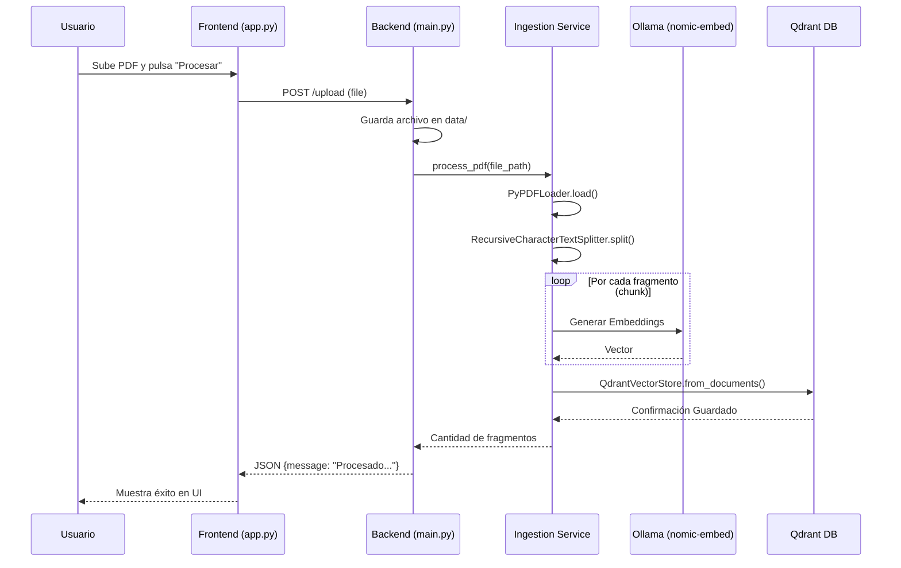
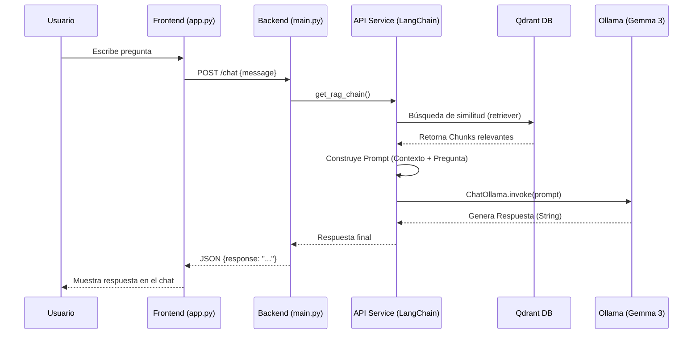

# Flujos del Sistema RAG

Este documento detalla los flujos lógicos del sistema mediante diagramas de secuencia de Mermaid.

## 1. Flujo de Ingesta de Documentos
Este proceso ocurre cuando el usuario sube un PDF desde la interfaz.

## 2. Flujo de Consulta (RAG Chat)
Este proceso ocurre cuando el usuario realiza una pregunta.

## 📂 Archivos Clave para el Entendimiento

| Archivo | Responsabilidad |
| :--- | :--- |
| `docker-compose.yml` | Orquestación de servicios (Ollama, Qdrant, Backend, Frontend). |
| `frontend/app.py` | Interfaz de usuario con Streamlit y llamadas a la API. |
| `backend/main.py` | Definición de endpoints FastAPI y manejo de archivos. |
| `backend/services/ingestion.py` | Lógica de extracción de texto, fragmentación y carga en Qdrant. |
| `backend/services/api.py` | Configuración de la cadena RAG con LangChain y Gemma 3. |
| `.gitignore` | Configuración para evitar subir datos locales o binarios. |
